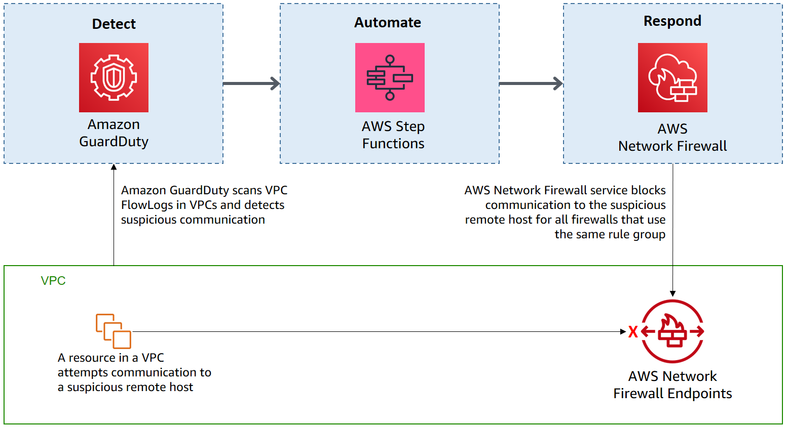

# Automated Traffic block with Network Firewall from Guardduty  

### Description
Solution to block traffic automatically with using AWS Network Firewall, respond to potential security events detected by Amazon Guardduty.  

This solution is originated by [AWS Blog posts](https://aws.amazon.com/ko/blogs/security/automatically-block-suspicious-traffic-with-aws-network-firewall-and-amazon-guardduty/)  

